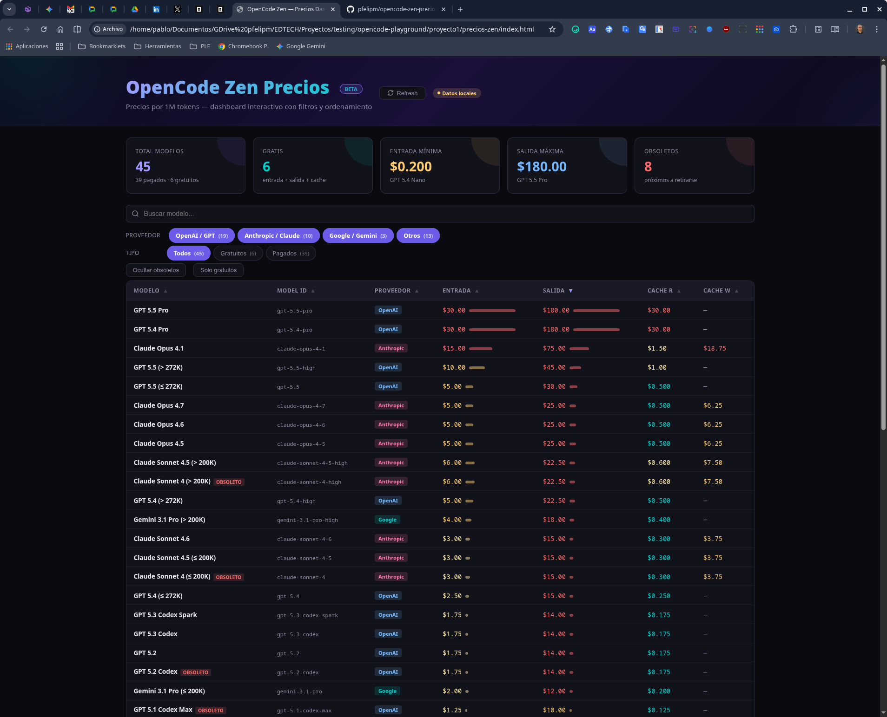

# Dashboard de precios de OpenCode Zen

Dashboard interactivo de página única para explorar y comparar los precios de modelos de IA de [OpenCode Zen](https://opencode.ai/docs/es/zen/#precios).

### [>> Pruébalo en vivo <<](https://pfelipm.github.io/opencode-zen-precios/)



---

## Arquitectura

| Capa | Tecnología |
|------|-----------|
| Marcado | HTML5 vanilla |
| Estilos | CSS3 vanilla (custom properties, grid, flexbox) |
| Lógica | ES6+ vanilla (sin frameworks, sin dependencias) |
| Fuente de datos | HTML remoto scrapeado en tiempo de ejecución vía `fetch()` |
| Despliegue | Archivo estático — sirve desde cualquier sitio o abre localmente |

Cero dependencias npm. Cero paso de build. Un archivo.

---

## Pipeline de datos

### Estrategia de fetch (al cargar la página + refresh manual)

```
1. Fetch directo → https://opencode.ai/docs/es/zen/
   │
   ├─ éxito → parsear HTML
   │
   └─ fallo (CORS) → intentar proxies CORS en orden:
       │
       ├─ https://api.allorigins.win/raw?url=...
       │
       ├─ https://corsproxy.io/?...
       │
       └─ todos fallan → usar FALLBACK_DATA embebido
```

### Parseo de HTML (`parseDataFromHTML`)

La página en `opencode.ai/docs/es/zen/` contiene tres elementos `<table>`. El parser usa `DOMParser` para extraer:

| Tabla | Identificada por | Campos extraídos |
|-------|-----------------|-----------------|
| **Endpoints** | Encabezado de columna contiene `"model id"` | mapeo `name → id` |
| **Precios** | Encabezado de columna contiene `"entrada"` o `"input"` | `name`, `input`, `output`, `cacheRead`, `cacheWrite` |
| **Obsoletos** | Encabezado de columna contiene `"retirada"` o `"retirement"` | mapeo `name → fecha de retirada` |

Las celdas de precio se parsean con `parsePriceCell()`, que maneja `"Free"` → `0`, `"$5.00"` → `5.0`, `"—"` → `null`.

La detección de proveedor (`detectProvider`) clasifica los modelos por prefijo del nombre/ID:
- `gpt*` → OpenAI
- `claude*` → Anthropic
- `gemini*` → Google
- Todo lo demás → Otros

### Datos de respaldo

`FALLBACK_DATA` es un array de 46 objetos de modelo embebido en el archivo. Se usa cuando todas las peticiones de red fallan. Es navegable inmediatamente al abrir la página, antes de que cualquier fetch se complete.

---

## Modelo de datos

Cada modelo es un objeto con esta estructura:

```js
{
  name:        string,   // Nombre a mostrar, ej. "Claude Sonnet 4.5 (≤ 200K)"
  id:          string,   // ID del modelo para config, ej. "claude-sonnet-4-5"
  provider:    string,   // "openai" | "anthropic" | "google" | "other"
  input:       number|null,   // Precio por 1M tokens de entrada (USD)
  output:      number|null,   // Precio por 1M tokens de salida (USD)
  cacheRead:   number|null,   // Precio por 1M tokens de cache de lectura
  cacheWrite:  number|null,   // Precio por 1M tokens de cache de escritura
  free:        boolean,       // true si input===0 && output===0
  deprecated:  string|null,   // Fecha de retirada, ej. "July 23, 2026"
}
```

---

## Funcionalidades

### Filtrado

| Control | Comportamiento |
|---------|---------------|
| **Buscador** | Filtro de texto en tiempo real sobre `name` e `id` |
| **Chips de proveedor** | Alterna OpenAI / Anthropic / Google / Otros (multi-selección) |
| **Chips de tipo** | Todos / Gratuitos / De pago |
| **Ocultar obsoletos** | Alterna para eliminar modelos con fecha de retirada |
| **Solo gratuitos** | Alterna para mostrar solo modelos con `free === true` |

### Ordenamiento

Clic en cualquier encabezado de columna para ordenar ascendente/descendente. Las columnas de texto (`name`, `id`, `provider`) ordenan asc por defecto al primer clic; las numéricas ordenan desc. Indicador visual (▲/▼) en la columna activa.

### Modo comparar

1. Marca filas de modelos individuales con los checkboxes de cada fila
2. El checkbox del encabezado alterna seleccionar/deseleccionar todos los visibles
3. Clic en **Comparar** para filtrar la tabla y mostrar solo los marcados
4. Clic en **Salir de comparar** para volver a la vista normal
5. Los checkboxes persisten al cambiar filtros y ordenamiento

### Tarjetas de estadísticas

Cinco tarjetas resumen en la parte superior, calculadas a partir de los datos filtrados actualmente:
- Total de modelos (desglose de pago + gratuitos)
- Cantidad de modelos gratuitos
- Precio de entrada más bajo (se muestra el nombre del modelo)
- Precio de salida más alto (se muestra el nombre del modelo)
- Cantidad de modelos obsoletos

### Indicador de estado

Una píldora en el encabezado muestra el estado de la fuente de datos:
- **Datos en vivo** (verde) — parseado correctamente desde el remoto
- **Datos locales** (naranja) — usando datos de respaldo
- **Fallback local** (rojo, temporal) — el fetch acaba de fallar
- **Cargando…** (naranja) — fetch en progreso

### Botón de actualizar

Re-ejecuta el pipeline completo de fetch con una animación de spinner durante la petición.

### Sección de información colapsable

Clic en "¿Qué hace esta app y cómo funciona?" debajo del encabezado para desplegar una explicación detallada de la fuente de datos, la lógica de parseo y los controles disponibles.

### Modal de atribución

El botón "Autor" abre un modal con la foto del autor, nombre y enlaces a sus perfiles de LinkedIn y GitHub. Se cierra con clic en el overlay, el botón de cierre o la tecla `Escape`.

---

## Diseño visual

- **Tema oscuro** con custom properties de CSS
- **Precios codificados por color**: verde (gratis/barato ≤$0.5) → amarillo → naranja → rojo (caro >$10)
- **Barras de precio**: barras horizontales inline proporcionales al valor máximo de la columna
- **Badges de proveedor**: codificados por color según la familia del proveedor
- **Badges de obsoleto**: píldora roja con tooltip que muestra la fecha de retirada
- **Responsivo**: grid/tarjetas se reorganizan en móvil; barras de precio se ocultan en pantallas estrechas

---

## Estructura de archivos

```
.
├── index.html    # SPA completa (HTML + CSS + JS en un archivo)
└── README.md     # Este archivo
```

---

## Ejecución

```bash
# Opción 1: Abrir directamente
open index.html              # macOS
xdg-open index.html          # Linux

# Opción 2: Servidor HTTP simple (necesario para algunos proxies CORS)
python3 -m http.server 8000
# Luego visitar http://localhost:8000

# Opción 3: Cualquier host estático (Netlify, Vercel, GitHub Pages, etc.)
# Simplemente despliega el archivo index.html
```

---

## Limitaciones

- **CORS**: El fetch directo a `opencode.ai` probablemente será bloqueado por la política de same-origin del navegador. El fallback de proxies lo maneja, pero los proxies pueden tener límites de tasa o caídas.
- **Fragilidad del parseo**: Si la estructura de la página fuente cambia (encabezados de tabla, orden de columnas), el parser puede romperse. Los datos de respaldo aseguran que el dashboard siempre funcione.
- **Sin persistencia**: Las selecciones de checkboxes y el estado de los filtros están solo en memoria — se pierden al recargar la página.
- **Sin componente de servidor**: Toda la computación es del lado del cliente. No se necesitan claves de API.

---

## Autor

**Pablo Felip**
- [LinkedIn](https://www.linkedin.com/in/pfelipm/)
- [GitHub](https://github.com/pfelipm/)

---

## Licencia

Este proyecto se proporciona tal cual para uso educativo y personal. Los datos de precios pertenecen a [OpenCode / Anomaly](https://opencode.ai).
